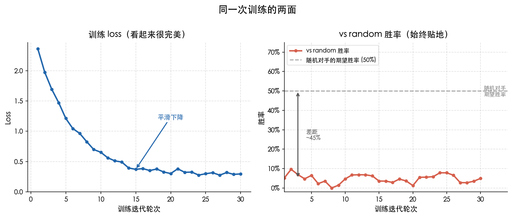
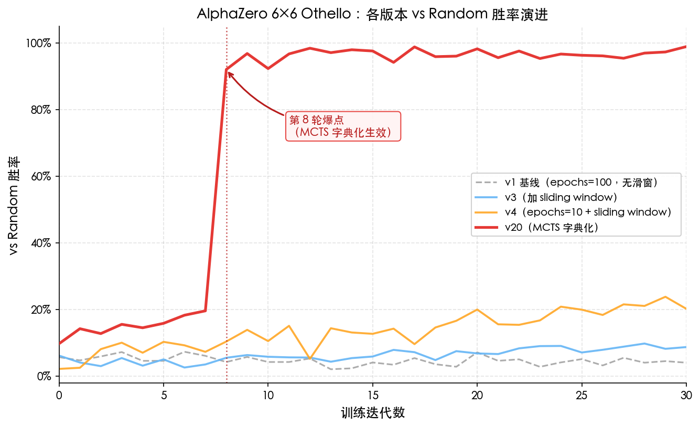
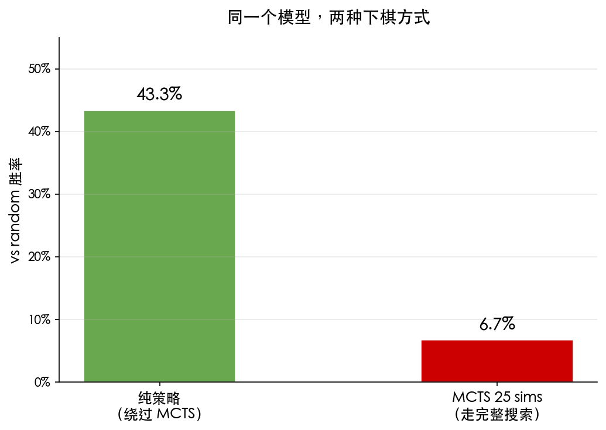
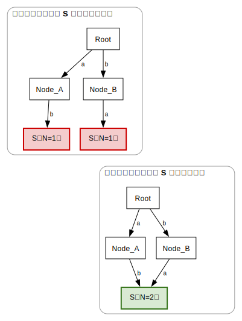

# 一个 AlphaZero 卡在 13% 胜率：真凶是一个数据结构

> 6x6 Othello · AlphaZero 复现笔记 · 2026-04

<!-- SPEC: docs/superpowers/specs/2026-04-15-alpha-zero-training-story-design.md -->

2017 年，DeepMind 发布了 AlphaZero。它用同一套算法先后在围棋、国际象棋和将棋上击败了各自领域最强的程序——而且不需要任何人类棋谱。整个系统只有三个组件：一个神经网络负责评估局面和预测落子，一个蒙特卡洛树搜索（MCTS）负责在对弈时做多步推演，以及一个"自我对弈"的训练循环让系统从零开始、和自己下棋、从自己的棋谱中学习。没有开局库，没有残局表，没有人类经验——从一张白纸到超越人类，只靠算力和算法。

这个想法让我着迷。我想自己从头实现一个 AlphaZero，不是为了做研究，而是为了真正理解它是怎么工作的。论文能告诉你架构和公式，但只有亲手训练一个模型，才能体会到"自我对弈产出的数据质量"和"搜索的统计效率"这些纸面上一笔带过的东西。

围棋太贵了——AlphaGo Zero 用了 5000 块 TPU 训了 40 天。但选什么棋也有讲究。网上很多 AlphaZero 教程用井字棋（Tic-Tac-Toe）或者六子棋来演示，棋盘小、规则简单、跑起来快。问题是这类游戏的状态空间太小，暴力搜索就能穷举所有可能，神经网络有没有真正学到东西根本看不出来——你分不清模型是"学会了下棋"还是"碰巧在一个搜索能兜底的游戏里混过去了"。

我选了 Othello（黑白棋）。6x6 的棋盘上，平均每步有 4 到 5 个合法落子，一局大约 30 步左右。粗略估算搜索空间是 4^30 ≈ 10^18 量级——在我的笔记本上暴力穷举完全不可能。这意味着神经网络必须真正学到有用的棋形判断，MCTS 必须真正做出有效的搜索剪枝，系统才有可能下出像样的棋。如果训练成功，我能确信是算法在起作用，而不是搜索空间小到随便猜都行。

社区里有一个成熟的参考实现 alpha-zero-general，支持多种棋类。我以它为蓝本，在自己的笔记本上搭好了训练框架。AlphaZero 的训练循环并不复杂：自我对弈产生棋谱数据，神经网络从中学习策略和局面评估，然后让新模型和旧模型在 Arena 里打一组对局——胜率超过 60% 才接受新模型，否则回滚。循环往复，理论上模型会越来越强。不过我没有用参考实现里那套复杂的棋力评估方式，而是选了一个更粗暴的检验：让模型和一个"每步从合法位置里随机选一个"的对手打。随机对手当然不强，但正因为不强，如果模型连它都赢不了，那就说明什么都没学到；如果能 100% 碾压它，至少能排除靠运气过关的可能——模型是真的学到了东西。

我跑了几周。loss 曲线漂亮得像教科书：平滑下降，没有震荡，没有发散。我觉得差不多了，让它和随机对手打了 50 局。

胜率 5%。



比随机还差。loss 在骗我。

---

我开始翻代码。第一轮排查找到了三件事，每一件都是独立的 bug，每一件都在无声地阻止模型变强。

**变量名骗了我。** 训练循环里有个参数叫 `num_epochs`，我设成了 100，觉得"数据过 100 遍，够多了"。但翻开 for 循环一看，它并不是"遍历整个数据集"的 epoch——每次迭代只随机抽一个 batch（128 个样本）做一次梯度更新，跑 100 次就结束。`num_epochs=100` 听起来是 100 个 epoch，做的事情是 100 次 gradient step。训练 buffer 里有上万条样本，100×128 = 12800，连一遍都没过完。

对比 alpha-zero-general 的参考实现，差距一目了然：

```python
for epoch in range(self.num_epochs):
    for _ in range(batch_count):
        sample_ids = np.random.randint(n, size=self.batch_size)
```

每个 epoch 内部遍历 `batch_count = n / batch_size` 个 batch，`num_epochs=10` 约等于对每条样本期望看 10 次。我的旧代码用同样的变量名，做的事情少了一个数量级。教训很朴素：读代码别信变量名。

**训练 buffer 没有滑动窗口。** 十几轮自我对弈产生的所有数据，从第 1 轮到第 15 轮，全部堆在同一个训练集里。第 1 轮的策略是什么水平？几乎是随机走子。第 15 轮呢？已经比随机稍强一点。把这两代策略产生的棋谱混在一起喂给网络，等于让它同时学两套互相矛盾的下法。旧数据像锚一样拖住新策略，网络学到的是所有历史版本的平均值——一个谁也不像的折中。加上"只保留最近 20 轮数据"的滑动窗口之后，训练集的策略分布才不再自相矛盾。

**没有外部 baseline。** Arena 机制是新模型对旧模型打 40 局，赢 60% 以上就接受。这是一个自嗨回路——如果旧模型本身接近随机水平，新模型只需要比"几乎随机"稍强就能通过。通过了 Arena 不代表变强了，只代表没变得更差。我缺的是一根不会漂移的温度计。加一个"每轮训练结束后和永远不变的随机对手打 50 局"，成本不到 10 秒，但这是整个训练过程中第一个能告诉我模型真实水平的指标。

---

三件事改完，vs random 胜率爬到了 22%。



从 5% 到 22%，进步巨大。我以为故事结束了。

> **loss 不等于能力。ML 里最便宜的体检是一个永远不变的外部对手。**

---

22% 看上去是进步，但模型在那之后再也没赢过更多。

我又训了十几轮，从 v16 到 v19，每个版本跑完都去和随机对手打 50 局。胜率在 10% 到 13% 之间晃，峰值 13.3%，比修 bug 之前的 22% 还低。滑动窗口的引入意味着早期的垃圾数据被丢掉了，训练集更干净了，但新一轮训练从更低的起点重新爬——爬到 13% 就再也上不去。我反复看着四个版本几乎重合的胜率曲线，意识到这不是"还没收敛"。收敛是一个渐近过程，每轮都有微小的进步，直到增益可以忽略。这里不是增益变小了，是增益完全归零了。这是一堵天花板。

---

**调超参。** 最直觉的反应：也许学习率不对，也许探索噪声不对。我把 LR 从 1e-3 往下扫到 1e-4，把 MCTS 根节点的 Dirichlet 噪声 α 从 0.3 调到 0.8，把每轮训练的 epoch 数从 10 拉到 20。排列组合，每次只改一个变量，跑完整个训练循环，再去和随机对手对局。每轮训练要跑好几十分钟，跑完去看结果。曲线几乎没有变化。不是"变好一点"或"变差一点"——是纹丝不动，像在描同一条线。LR 小到 1e-4，曲线慢了，但天花板没变。α 拉大到 0.8，理论上搜索时探索更多，曲线也没动。超参调优有一个前提：模型的学习通路是通的，你调的是流速。如果通路本身堵了，流速调多少都一样。我开始怀疑堵的不是超参。

**加网络容量。** 第二个念头：也许 128 channels 的残差网络太小了，表达能力不够。6x6 棋盘虽然比标准 Othello 小一圈，但合法局面空间仍然有几千万，四层残差块加 128 个 channel 也许不足以编码足够细的棋形特征。我把 channels 扩到 256，参数量翻了差不多四倍，顺手加了 dropout 防止过拟合。训练跑起来之后，loss 确实更低了——策略头和价值头的损失都比之前降了一截，曲线干净利落。更大的网络在训练集上拟合得更好。我带着一点期待去跑 vs random 评估。

loss 更低了。胜率没动。

这是第二次被 loss 骗。第一次我以为是训练代码写错了，修完之后还能安慰自己"至少找到了原因"。这一次，训练代码是对的，网络更大了，loss 诚实地在下降——但下降的 loss 没有转化成下棋的能力。网络在训练集上学到了更精确的拟合，但那份精度在实战中没用。问题不在网络能不能学到东西，而在它学习的来源——自我对弈产生的棋谱——本身是否可靠。如果棋谱数据被什么东西系统性地扭曲了，网络学得再好也只是在精确地记住一份错误的教材。

**回代码找 bug。** 超参和容量都排除之后，我回到 MCTS 的源码里逐行 review。这次确实找到了几个真 bug：terminal 局面返回胜负值的时候，视角方向搞反了——本该返回当前玩家的胜负，写成了上一个玩家的。这意味着在对局结束时，赢家的 MCTS 节点收到的是"我输了"的信号，输家收到的是"我赢了"。还有一处，当一方被迫 pass（没有合法落子）时，backpropagation 中忘了切换玩家标记，导致胜负信号被归到了错误的一方。这些都是真问题，每一个都会导致搜索树里的统计量出现方向性错误。修了之后代码在逻辑上更正确了，我确信这些修复是对的。我又跑了一轮完整训练。天花板还是 13%。正确的修复，无效的结果。这种感觉比找不到 bug 更让人不安——你知道你做的事是对的，但局面没有任何改善，说明真正的问题在别处，而你连往哪个方向找都不知道。

---

所有外部调整都试过了。超参、网络容量、已知的代码 bug——每一条线索都走到了尽头。我需要换一个思路：不再问"哪里写错了"，而是问一个更基本的问题——搜索和网络，到底是谁在拖后腿？

这两个模块在 AlphaZero 里是紧密耦合的。训练时，MCTS 用网络的输出来引导搜索方向，搜索的结果又回过头来作为训练标签。对弈时，网络给出初始判断，搜索在此基础上做多步推演来改进决策。系统出了问题的时候，你很难从最终的胜率数字上分辨是网络学到的判断不对，还是搜索把正确的判断带偏了。我需要一个能把它们拆开看的探针。

我设计了一个诊断实验。同一个训练好的模型，用两种方式下棋：

第一种，纯策略。不做 MCTS 搜索，不模拟、不展开、不回溯。网络看到当前棋盘，策略头输出 36 个位置的概率分布，取概率最高的合法位置直接落子。这相当于只用网络的"第一直觉"——它觉得哪里最该下，就下哪里，不做任何推演。

第二种，完整 MCTS。25 次模拟，正常的搜索流程：选择、展开、评估、回溯，最后根据访问次数选择落子。这是训练和对弈时用的标准方式。

两种方式各打 30 局 vs random。



纯策略 43.3%。MCTS 25 sims 6.7%。

我盯着那个 43.3% 看了很久。

网络自己的第一直觉能赢随机对手 43%——接近一半，离"稳定强于随机"已经不远了。这说明网络确实从自我对弈中学到了一些有用的棋感：哪些位置更有价值，哪些开局定式值得模仿。但加上 25 次搜索模拟之后，胜率从 43% 掉到了 6.7%。搜索没有帮助网络，搜索在摧毁网络已经学到的判断。每一次模拟、每一次回溯，都在把网络的正确直觉往错误的方向拽。25 次模拟积累的"经验"，把一个能赢四成的选手打成了一个比随机还差的选手。

如果让搜索介入反而让模型变弱，那答案只有一个——搜索本身坏了。

---

但算法没写错，UCB 公式和原论文一致，展开和回溯的逻辑也对过了，已知的代码 bug 也修了。那只剩一种可能：不是搜索怎么算的有问题，而是搜索怎么存放信息的有问题。

---

我重新打开 alpha-zero-general 的 `MCTS.py`。这次不看算法逻辑，只看数据结构。文件最顶上，构造函数里，搜索的全部状态就是五个 Python 字典：

```python
self.Qsa = {}   # (s_key, a) -> Q value
self.Nsa = {}   # (s_key, a) -> visit count
self.Ns = {}    # s_key -> sum of child visits
self.Ps = {}    # s_key -> policy prior vector
self.Vs = {}    # s_key -> valid-moves mask
```

五个 dict，没有任何树结构。没有 Node 类，没有 children 指针，没有 parent 引用。`s_key` 是棋盘状态的字节表示——把整个 6x6 的棋盘按行展开成一维数组，转成 bytes，作为字典的 key。所有搜索统计量——某个局面下某个动作的期望收益 Q、访问次数 N、策略先验 P——全部以这个 bytes key 索引。

再看我自己的实现。我写的是教科书式的树搜索：一个 `Node` 类，每个节点持有 `children` 字典、`visit_count`、`value_sum`、`prior`。搜索从 root 节点开始，沿着 UCB 分数最高的子节点一路向下递归，遇到叶子就展开——调用神经网络评估局面，用策略头的输出为每个合法动作创建子节点——然后沿着 parent 指针一路回溯，更新路径上每个节点的统计量。数据结构清晰，代码可读性好，任何一本 AI 教科书都会这么写。我写的时候甚至有一种"这才是正经实现"的自信。

两套代码都能跑，都能输出动作概率，单元测试都能过。但它们在语义上有一个本质区别。

树看到的是路径。字典看到的是终点。

Othello 里，同一个棋盘局面可以由不同的下法顺序到达。假设黑棋先下 a3 再下 c5，和先下 c5 再下 a3——中间白棋的应对可能不同，但在某些情况下，最终到达的棋盘状态是完全一样的：同样的黑子位置，同样的白子位置，同样的轮到谁走。这在博弈论里叫 transposition——不同的走法序列收敛到同一个局面。国际象棋引擎几十年前就用 transposition table 来处理这个问题。Othello 的 transposition 比国际象棋更频繁，因为落子只在特定方向上翻转棋子，不同顺序到达同一个终态的概率更高。

**在树实现里，** root→a3→...→c5→S 和 root→c5→...→a3→S 是两个不同的叶子节点。它们各有各的 `visit_count`，各有各的 `value_sum`。即使它们代表的棋盘状态完全相同，搜索不知道这件事，也没有任何机制让它们共享统计数据。每个 Node 是一座孤岛。

**在字典实现里，** 不管从哪条路径到达，只要 `canonical_state.astype(np.int8).tobytes()` 相同，就命中同一个 dict entry。两条路径的模拟结果累加到同一个 Q 值、同一个 N 值。搜索天然地知道"这两个地方是同一个地方"。



这个区别在搜索预算充裕的时候也许无关紧要——AlphaGo Zero 用的是 1600 次模拟，如果你有 800 或 1600 次，树的每个节点也能攒够足够多的访问量来消除噪声。但我只有 25 次模拟。25 次——这是 alpha-zero-general 对小棋盘的默认配置，省计算量，代价是每一次模拟都必须被高效利用。在树实现下，这 25 次模拟被分散到不同路径上的不同 Node，每个 Node 也许只被访问过 1 到 2 次。一次访问得到的 Q 值就是一次神经网络评估的原始输出，方差极大，几乎没有统计意义。搜索在用噪声指导决策——不如不搜索，这正好解释了为什么纯策略 43% 而加上 MCTS 只剩 6.7%。字典实现下，多条路径汇聚到同一个 state key，同一个局面可以积累 5 到 10 次访问。方差降低，信号浮现。同样的 25 次预算，信噪比差一个数量级。

还有一个更隐蔽的影响。alpha-zero-general 在 Arena 的 40 局对战之间不清空字典。第一局开局探索过的 d3 位置，到了第五局再遇到同样的开局，字典里已经有了四局积累的统计量。常见的开局局面跨局累积了成百上千次访问，等效搜索深度远远超过名义上的每步 25 次模拟。这是字典实现"免费"获得的红利——你不需要写任何额外代码，数据结构本身就在帮你做这件事。我的树实现呢？每局对弈创建一棵全新的空树。40 局就是 40 棵彼此毫无关联的树。那个红利，我一分钱都没吃到。

为了确认这个判断，我做了一个 A/B 测试。拿 v19 第 2 轮迭代训练出来的同一个 checkpoint，只替换搜索模块：一边是原来的 Node 树实现，一边是按字典形态重写的版本。其他一切不变——同一个网络权重、同样的 25 次模拟、同样的 c_puct 参数。各打 30 局 vs random。

树实现 13.3%。字典实现 63.3%。

同一个模型。同一个算法。只换了搜索怎么存放信息。胜率翻了将近 5 倍。

---

我把 MCTS 推倒重来。删掉 Node 类，删掉 children 指针，删掉 parent 引用，删掉所有递归。整个搜索的状态就是五个 dict。每个局面的唯一标识，是这一行：

```python
return canonical_state.astype(np.int8).tobytes()
```

这一行，就是区别所在。

重写后的第一次训练。第 8 个迭代的 Arena 结束之后，我照例去跑 vs random 评估。

100%。

50 局全赢。不是 60%，不是 80%——100%。从第一个迭代就开始碾压随机对手，到第 8 个迭代已经找不到对手了。之前调了三周的所有超参、加的网络容量、修的代码 bug，都没这一行管用。

前面三周我一直以为问题在"代码写错了"或者"超参没调对"。我按照 debug 的直觉行事：先查明显的 bug，再调超参，再加容量，再精读代码逐行排查。每一步都合理，每一步都有收获，但每一步都没有触及真正的问题。因为真正的问题比代码 bug 更深一层：我选了一个错误的数据结构。树和字典都能实现 MCTS，教科书上甚至更倾向于用树来讲解——因为更直观，更容易画图，更容易让学生理解"选择-展开-评估-回溯"的四步循环。但在有 transposition 的博弈中、在搜索预算极其有限的条件下，树结构会系统性地浪费每一次模拟。不是某行代码写错了，是每一行代码都在忠实地执行一个错误的设计。

> **在对抗搜索里，同构局面必须被识别。数据结构是算法的一部分，不是实现细节。**

> **当调参和代码 review 都无效，怀疑你的数据表示。**

---

三周走完这条弯路之后，我想带进下一个项目的教训只有三条。

**1. 永远有一个不变的外部 baseline。** loss 曲线和 Arena 胜率是照镜子——它们告诉你今天的你比昨天好不好看，但不告诉你在人群中是什么水平。镜子会随着你一起漂移：旧模型本身就弱的时候，赢过旧模型什么都不能说明。你需要的是一台体重计，一个永远不会变的参照点。随机对手就够了，只要它永远是同一个随机对手。10 秒的评估成本，能省几周的弯路。

**2. 复现时别信变量名。** 照着 reference 实现逐行对齐，是最没面子但最有效的 debug 动作。`num_epochs` 可以不是 epochs，`best_model` 可以不是 best——变量名是给人读的注释，不是给机器执行的契约。"我的代码和参考实现在高层结构上一样"远远不够。高层结构一样、底层语义不同，恰恰是最难发现的那类 bug，因为你的眼睛会自动跳过"看起来没问题"的代码。

**3. 当调参和 review 都无效，怀疑你的数据表示。** 算法教科书讲的是"它应该怎么算"，数据结构决定了"它实际在算什么"。两个 MCTS 实现可以算法完全等价、渐近复杂度相同，但一个训出 100% 胜率，另一个永远卡在 13%。区别只是 dict 还是 tree——一个能识别同构局面，一个不能。数据结构不是实现细节，它是算法语义的一部分。

下次再见到一条看起来没毛病的 loss 曲线，我会先问一个问题：它打得过随机吗？
