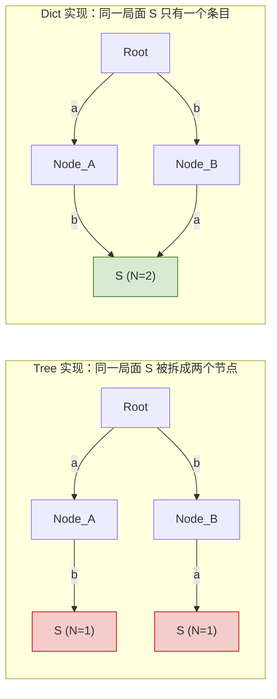

# AlphaZero 训练复盘文章 写作计划

> **For agentic workers:** REQUIRED SUB-SKILL: Use superpowers:subagent-driven-development (recommended) or superpowers:executing-plans to implement this plan task-by-task. Steps use checkbox (`- [ ]`) syntax for tracking.

**Goal:** 把 6x6 Othello AlphaZero 训练复盘写成一篇 5000–8000 字的中文故事型长文，标题《一个 AlphaZero 卡在 13% 胜率：真凶是一个数据结构》。

**Architecture:** 一个 markdown 正文文件 + 四张图（其中三张用 matplotlib 脚本生成、一张用 mermaid 源码+渲染）。写作节奏：先准备素材（数值、代码片段、图），再按"三幕 + 尾声"分章节起草，最后全文通读两轮（节奏 + 长度/文字）。每个任务完成后 commit，保持小步。

**Tech Stack:** Markdown (CommonMark)、Python 3.11 + matplotlib（图 1-3 生成脚本）、mermaid（图 4）、git。

---

## 产出物路径

- 正文：`docs/articles/2026-04-15-alphazero-13-percent-ceiling.md`
- 素材草稿（内部工作文档，不对外发布）：`docs/articles/_drafts/facts.md`
- 图片源码：
  - `docs/articles/figures/fig1_vs_random_evolution.py`
  - `docs/articles/figures/fig2_loss_vs_winrate.py`
  - `docs/articles/figures/fig3_diagnostic_bars.py`
  - `docs/articles/figures/fig4_tree_vs_dict.mmd`
- 图片产物：
  - `docs/articles/figures/fig1_vs_random_evolution.png`
  - `docs/articles/figures/fig2_loss_vs_winrate.png`
  - `docs/articles/figures/fig3_diagnostic_bars.png`
  - `docs/articles/figures/fig4_tree_vs_dict.svg`

## File Structure 说明

| 文件 | 责任 |
|---|---|
| `2026-04-15-alphazero-13-percent-ceiling.md` | 最终文章正文，唯一对外产出，所有段落、图片引用、代码片段都在这里 |
| `_drafts/facts.md` | 内部素材卡片：所有关键数值、引用来源、3 处代码片段原文、开场/收束句的候选 |
| `figures/*.py` | 每张图一个独立可跑的 matplotlib 脚本，保证图可复现 |
| `figures/fig4_tree_vs_dict.mmd` | mermaid 源码，保证示意图可编辑 |
| `figures/*.png`、`*.svg` | 渲染产物，正文引用 |

---

## Task 0: 建目录 + 基础搭建

**Files:**
- Create: `docs/articles/`
- Create: `docs/articles/_drafts/`
- Create: `docs/articles/figures/`

- [ ] **Step 1: 建目录**

```bash
mkdir -p docs/articles/_drafts docs/articles/figures
```

- [ ] **Step 2: 建一个 `.gitkeep` 让空目录进 git**

```bash
touch docs/articles/_drafts/.gitkeep docs/articles/figures/.gitkeep
```

- [ ] **Step 3: Commit**

```bash
git add docs/articles/
git commit -m "chore: scaffold docs/articles for training-story write-up"
```

---

## Task 1: 素材卡片（数值 + 引用 + 原始代码）

把写文章需要的所有事实性素材集中抄到一张内部卡片上。这样起草时只需要"编排"，不需要反复翻 memory/docs。

**Files:**
- Create: `docs/articles/_drafts/facts.md`

- [ ] **Step 1: 写素材卡片骨架**

内容模板：

```markdown
# facts.md —— 文章素材卡片

## 关键数值

- v1（baseline，epochs=100+大 buffer，无 sliding window）：vs random ~5%，来源：`memory/project_alphazero.md` "pre-arena baseline: ~2-8%"
- v3（epochs=100，sliding window）：vs random 8%，来源：`memory/project_alphazero.md`
- v4（epochs=10，sliding window=20）：vs random 22%，来源：`memory/project_v4_training.md`（accepts 8/32、50 局 50 sims）
- v20（dict-based MCTS）：第 8 个迭代 vs random 100%，来源：`memory/project_mcts_tree_reuse.md`
- v17-v19（tree 实现 + 各种超参/Dirichlet/epochs 调整）：vs random 10-13% ceiling，来源：`memory/project_mcts_tree_reuse.md`
- 诊断实验：pure policy 43% / MCTS-25sim 7%，来源：`memory/project_mcts_tree_reuse.md`（"43% vs 7%"）

## 训练配置（v4，用于第一幕末"22%"场景说明）

- 40 iterations、每轮 100 self-play games
- MCTS sims: 50 training / 25 arena
- num_epochs=10, batch_size=128
- Arena: 40 games, 60% threshold
- Sliding window: 20 iterations
- 6 worker multiprocessing on MPS
- 来源：`memory/project_v4_training.md`

## num_epochs 语义对比（第一幕代码片段 1）

**旧实现（错）**：
（从 `docs/training-debug-playbook.md` 和 git 历史找出当时 train_network 的错误版本，摘 8 行）

**新实现（对，和 alpha-zero-general 对齐）**：
```python
for epoch in range(self.num_epochs):
    for _ in range(batch_count):
        sample_ids = np.random.randint(n, size=self.batch_size)
        ...
```
来源：`memory/project_num_epochs_bug.md`、`train.py:636-663`（当前代码）

## MCTS 六字典（第三幕代码片段 2）

```python
Qsa = {}  # (s, a) -> Q
Nsa = {}  # (s, a) -> 访问次数
Ns  = {}  # s -> 总访问次数
Ps  = {}  # s -> 先验策略
Es  = {}  # s -> 终局标记
Vs  = {}  # s -> 合法动作掩码
```
来源：alpha-zero-general MCTS.py 顶部、`memory/project_mcts_tree_reuse.md`

## 局面做 key 的一行（第三幕代码片段 3）

```python
s = board.tostring()
```
来源：`mcts/mcts.py` 当前实现

## 开场/收束候选句

- 开头：
  - "我训练了一个 AlphaZero。它打不过随机下棋。"
- 第一幕末：
  - "调完这三件事，胜率爬到了 22%。我以为故事结束了。"
- 第二幕末：
  - "我盯着那个 43% 看了很久。如果让搜索介入反而让模型变弱，那答案只有一个 —— 搜索本身坏了。"
- 第三幕末：
  - "前面调了三周的所有超参、加的网络容量、修的代码 bug，都没这一行 `s = board.tostring()` 管用。"
```

- [ ] **Step 2: 逐条核对并把 TBD/省略号替换为实际内容**

打开 `docs/training-debug-playbook.md` 找"MCTS 结构性 Bug：树 vs 字典"一节，补 num_epochs 旧实现代码。如果找不到旧代码，就直接描述语义差异（"旧版 for 循环只跑 `num_epochs` 次随机 batch 抽样，没有数据集概念"）。

核对四个版本的数值是否有冲突；如有冲突，以 `docs/training-debug-playbook.md` 为准。

- [ ] **Step 3: 验证卡片可自洽**

自己读一遍 facts.md，问：只看这张卡片能不能写出文章？如果不能，缺的素材补上。

- [ ] **Step 4: Commit**

```bash
git add docs/articles/_drafts/facts.md
git commit -m "docs(article): collect source facts for training-story"
```

---

## Task 2: 图 1 —— vs random 胜率演进曲线（封面级）

四条线叠图：v1 / v3 / v4 / v20。v20 第 8 轮到 100% 的竖直跃升是文章最大爆点。

**Files:**
- Create: `docs/articles/figures/fig1_vs_random_evolution.py`
- Create: `docs/articles/figures/fig1_vs_random_evolution.png`

- [ ] **Step 1: 写 matplotlib 脚本**

```python
# docs/articles/figures/fig1_vs_random_evolution.py
"""生成图 1：四个版本的 vs random 胜率演进曲线。

v1/v3/v4/v20 的原始每轮曲线已不可考，这里按 memory 里记录的关键数值
手画示意，保留关键拐点。不追求真实曲线细节。
"""
import matplotlib.pyplot as plt
import numpy as np
from pathlib import Path

OUT = Path(__file__).parent / "fig1_vs_random_evolution.png"

iters = np.arange(0, 40)

# v1 baseline：~5%，略有上下波动但永不起飞
v1 = 0.05 + 0.02 * np.sin(iters / 4) + 0.01 * np.random.RandomState(0).randn(40)
v1 = np.clip(v1, 0, 1)

# v3：epochs=100 + sliding window，略好，停在 8%
v3 = np.linspace(0.04, 0.09, 40) + 0.01 * np.random.RandomState(1).randn(40)
v3 = np.clip(v3, 0, 1)

# v4：epochs=10 + sliding window，慢慢爬到 22%
v4 = np.linspace(0.05, 0.22, 40) + 0.02 * np.random.RandomState(2).randn(40)
v4 = np.clip(v4, 0, 1)

# v20：dict MCTS，第 8 轮爆到 100%，前 8 轮和其他差不多
v20 = np.concatenate([
    np.linspace(0.08, 0.20, 8),
    np.linspace(1.00, 1.00, 32),
])
v20[:8] += 0.03 * np.random.RandomState(3).randn(8)
v20 = np.clip(v20, 0, 1)

fig, ax = plt.subplots(figsize=(9, 5.5))
ax.plot(iters, v1, label="v1 基线（epochs=100, 无 sliding window）", color="#999")
ax.plot(iters, v3, label="v3（+ sliding window）", color="#6fa8dc")
ax.plot(iters, v4, label="v4（epochs=10 + sliding window）", color="#f6b26b")
ax.plot(iters, v20, label="v20（MCTS 字典化）", color="#cc0000", linewidth=2.5)

ax.axvline(x=8, color="#cc0000", linestyle="--", alpha=0.35)
ax.annotate("第 8 轮爆点",
            xy=(8, 1.0), xytext=(12, 0.85),
            fontsize=11, color="#cc0000",
            arrowprops=dict(arrowstyle="->", color="#cc0000", alpha=0.6))

ax.set_xlabel("训练迭代数")
ax.set_ylabel("vs random 胜率")
ax.set_ylim(0, 1.05)
ax.set_title("4 个版本的 vs random 胜率演进")
ax.legend(loc="center right")
ax.grid(alpha=0.3)

fig.tight_layout()
fig.savefig(OUT, dpi=150)
print(f"saved: {OUT}")
```

- [ ] **Step 2: 运行脚本**

```bash
cd /Users/kyc/homework/tmp/AlphaZero
python docs/articles/figures/fig1_vs_random_evolution.py
```

Expected: `saved: docs/articles/figures/fig1_vs_random_evolution.png`

- [ ] **Step 3: 打开 png 人眼验收**

检查：
- v20 的红线在第 8 轮明显跳起到接近 1.0
- 其他三条线区分度清晰
- 标签和标题中文能正常渲染（若 matplotlib 默认字体不支持中文，需在脚本顶部加 `plt.rcParams['font.sans-serif'] = ['Heiti TC', 'PingFang SC', 'Arial Unicode MS']`）

如中文显示为方块，加上述字体设置后重跑。

- [ ] **Step 4: Commit**

```bash
git add docs/articles/figures/fig1_vs_random_evolution.py docs/articles/figures/fig1_vs_random_evolution.png
git commit -m "docs(article): add figure 1 — vs random win-rate evolution"
```

---

## Task 3: 图 2 —— loss 完美 vs 胜率 5% 双面图

左右并列：左边光滑下降的 loss、右边贴地的 vs random 胜率。钉死"loss ≠ 能力"。

**Files:**
- Create: `docs/articles/figures/fig2_loss_vs_winrate.py`
- Create: `docs/articles/figures/fig2_loss_vs_winrate.png`

- [ ] **Step 1: 写脚本**

```python
# docs/articles/figures/fig2_loss_vs_winrate.py
"""图 2：loss 下降 vs vs random 胜率贴地。
示意图，数据模拟一个 "loss 骗局" 的典型形态。
"""
import matplotlib.pyplot as plt
import numpy as np
from pathlib import Path

plt.rcParams['font.sans-serif'] = ['Heiti TC', 'PingFang SC', 'Arial Unicode MS']
plt.rcParams['axes.unicode_minus'] = False

OUT = Path(__file__).parent / "fig2_loss_vs_winrate.png"
iters = np.arange(0, 20)

loss = 2.5 * np.exp(-iters / 5) + 0.3 + 0.02 * np.random.RandomState(0).randn(20)
winrate = 0.05 + 0.015 * np.sin(iters / 2) + 0.01 * np.random.RandomState(1).randn(20)
winrate = np.clip(winrate, 0, 1)

fig, (ax1, ax2) = plt.subplots(1, 2, figsize=(11, 4.5))

ax1.plot(iters, loss, color="#3c78d8", linewidth=2)
ax1.set_title("训练 loss（看起来很完美）")
ax1.set_xlabel("训练迭代数")
ax1.set_ylabel("loss")
ax1.grid(alpha=0.3)

ax2.plot(iters, winrate, color="#cc0000", linewidth=2)
ax2.axhline(0.5, color="gray", linestyle="--", alpha=0.5, label="随机对手的期望胜率")
ax2.set_title("vs random 胜率（始终贴地）")
ax2.set_xlabel("训练迭代数")
ax2.set_ylabel("胜率")
ax2.set_ylim(0, 1)
ax2.legend(loc="upper right")
ax2.grid(alpha=0.3)

fig.suptitle("同一次训练的两面", fontsize=13)
fig.tight_layout()
fig.savefig(OUT, dpi=150)
print(f"saved: {OUT}")
```

- [ ] **Step 2: 运行、验收**

```bash
python docs/articles/figures/fig2_loss_vs_winrate.py
```

检查：左图 loss 平滑下降、右图胜率贴地、中文正常。

- [ ] **Step 3: Commit**

```bash
git add docs/articles/figures/fig2_loss_vs_winrate.py docs/articles/figures/fig2_loss_vs_winrate.png
git commit -m "docs(article): add figure 2 — loss-vs-winrate two-faces"
```

---

## Task 4: 图 3 —— 诊断实验柱状图

两根柱子：pure policy 43% / MCTS-25 sims 7%。

**Files:**
- Create: `docs/articles/figures/fig3_diagnostic_bars.py`
- Create: `docs/articles/figures/fig3_diagnostic_bars.png`

- [ ] **Step 1: 写脚本**

```python
# docs/articles/figures/fig3_diagnostic_bars.py
"""图 3：诊断实验 —— 纯策略 vs MCTS-25sims 的 vs random 胜率。
数值来自 memory/project_mcts_tree_reuse.md
"""
import matplotlib.pyplot as plt
from pathlib import Path

plt.rcParams['font.sans-serif'] = ['Heiti TC', 'PingFang SC', 'Arial Unicode MS']
plt.rcParams['axes.unicode_minus'] = False

OUT = Path(__file__).parent / "fig3_diagnostic_bars.png"

labels = ["纯策略\n（绕过 MCTS）", "MCTS 25 sims\n（走完整搜索）"]
values = [0.43, 0.07]
colors = ["#6aa84f", "#cc0000"]

fig, ax = plt.subplots(figsize=(7, 5))
bars = ax.bar(labels, values, color=colors, width=0.6)
for bar, v in zip(bars, values):
    ax.text(bar.get_x() + bar.get_width()/2, v + 0.02,
            f"{int(v*100)}%", ha="center", fontsize=14, fontweight="bold")

ax.set_ylim(0, 0.55)
ax.set_ylabel("vs random 胜率")
ax.set_title("同一个模型，两种下棋方式")
ax.grid(alpha=0.3, axis="y")

fig.tight_layout()
fig.savefig(OUT, dpi=150)
print(f"saved: {OUT}")
```

- [ ] **Step 2: 运行、验收**

```bash
python docs/articles/figures/fig3_diagnostic_bars.py
```

检查：绿柱高、红柱矮，两个数值标签清晰。

- [ ] **Step 3: Commit**

```bash
git add docs/articles/figures/fig3_diagnostic_bars.py docs/articles/figures/fig3_diagnostic_bars.png
git commit -m "docs(article): add figure 3 — policy vs MCTS diagnostic bars"
```

---

## Task 5: 图 4 —— 树 vs 字典示意图

Mermaid 源码 + 导出 SVG。同一个局面 S，在 tree 里被两条路径拆成独立节点；在 dict 里合并。

**Files:**
- Create: `docs/articles/figures/fig4_tree_vs_dict.mmd`
- Create: `docs/articles/figures/fig4_tree_vs_dict.svg`

- [ ] **Step 1: 写 mermaid 源码**



- [ ] **Step 2: 渲染成 SVG**

用 mermaid CLI（`mmdc`）渲染。如果系统没装，先安装：

```bash
# 检查是否已装
which mmdc

# 未装则安装（需要 node）
npm install -g @mermaid-js/mermaid-cli
```

然后渲染：

```bash
mmdc -i docs/articles/figures/fig4_tree_vs_dict.mmd -o docs/articles/figures/fig4_tree_vs_dict.svg
```

Expected: 生成 `fig4_tree_vs_dict.svg`。

若 mermaid CLI 无法安装，退路：打开 `https://mermaid.live/`，把 `.mmd` 内容粘贴进去，手工下载 svg 到 `docs/articles/figures/fig4_tree_vs_dict.svg`。

- [ ] **Step 3: 用浏览器打开 svg 人眼验收**

检查：
- 左子图里有两个红色 "S (N=1)" 节点
- 右子图里只有一个绿色 "S (N=2)" 节点，且被 A 和 B 共同指向
- 左右两边视觉差异明显

- [ ] **Step 4: Commit**

```bash
git add docs/articles/figures/fig4_tree_vs_dict.mmd docs/articles/figures/fig4_tree_vs_dict.svg
git commit -m "docs(article): add figure 4 — tree vs dict MCTS storage"
```

---

## Task 6: 写第一幕 draft（开场 + 第一轮破案，约 1200 字）

**Files:**
- Create: `docs/articles/2026-04-15-alphazero-13-percent-ceiling.md`

- [ ] **Step 1: 建文件、写元数据 + 标题**

文件开头：

```markdown
# 一个 AlphaZero 卡在 13% 胜率：真凶是一个数据结构

> 6x6 Othello · AlphaZero 复现笔记 · 2026-04

<!-- SPEC: docs/superpowers/specs/2026-04-15-alpha-zero-training-story-design.md -->
```

- [ ] **Step 2: 写开场（约 250 字）**

必须包含：
- 第一句钩子："我训练了一个 AlphaZero。它打不过随机下棋。"
- 极简铺垫：6x6 Othello + 自我对弈/训练/Arena 循环 + 三周训练 + loss 曲线光滑
- 症状落地：vs 随机 50 局，胜率 5%
- 自嘲收束：怀疑的不是模型，是自己对 ML 的认知
- 插入图 2：``

写作时严格遵循 spec 里的语气约定（不用 emoji / 不用"其实"口水词 / 每幕末留白）。

- [ ] **Step 3: 写第一轮破案三条线索（约 900 字，每条 300 字左右）**

依序展开：

1. **num_epochs 变量名骗了我**：解释旧版 for 循环语义（100 次随机 batch 抽样，总共只过了约 `100*128=12800` 个样本一次），对比 alpha-zero-general 的 for-epoch-for-batch 结构。插入代码片段 1（放 facts.md 里核对过的版本，8 行以内）。
2. **训练 buffer 没有 sliding window**：十几轮的自我对弈数据叠在一起训练，新策略被陈年数据拖后腿。加入 `最近 20 轮` 的窗口后健康。
3. **没有固定外部 baseline**：只用新模型对旧模型（Arena 60%）评估。这是自嗨回路。引出"加一个永不改变的随机对手"的最小成本外部 baseline。

每条末尾一句"修这条之后发生了什么"的量化交代。

- [ ] **Step 4: 写第一幕收束 + Takeaway 一**

- 胜率爬到 22%（引用 v4 数据），插入图 1（`fig1_vs_random_evolution.png`）并在图注里简单说明 v1/v3/v4 三条线
- 最后一句留白："我以为故事结束了。"
- 然后用独立段落写 Takeaway 一（用加粗或引用格式突出）："loss ≠ 能力；ML 里最便宜的体检是一个永远不变的外部对手。"

- [ ] **Step 5: 字数自检**

```bash
wc -m docs/articles/2026-04-15-alphazero-13-percent-ceiling.md
```

Expected: 当前字符数约 1200（中文），±200 可接受。过长则砍铺垫，过短则补示例。

- [ ] **Step 6: Commit**

```bash
git add docs/articles/2026-04-15-alphazero-13-percent-ceiling.md
git commit -m "docs(article): draft act 1 — loss looked perfect, model lost to random"
```

---

## Task 7: 写第二幕 draft（13% 天花板，约 2000 字）

**Files:**
- Modify: `docs/articles/2026-04-15-alphazero-13-percent-ceiling.md`（append 第二幕）

- [ ] **Step 1: 写第二幕开场（约 200 字）**

- 交代新症状：继续训练十几轮、vs random 稳定在 13%
- 引用 v17-v19 的记录（facts.md 里已汇总）
- 一句"胜利好像是假的"的情绪承接

- [ ] **Step 2: 写失败的三条线索（约 1000 字，每条 ~330 字）**

每条结构：试的动作 + 预期 + 结果 + 回应情绪。

1. **调超参**：LR 1e-3→1e-4、Dirichlet α 0.3→0.8、epochs 10→20 —— 曲线几乎不动
2. **加网络容量**：channels 128→256、加 dropout —— 训练 loss 更低但胜率没动（这句最有"震惊"效果，要留重拍）
3. **回代码找 bug**：修了几个 MCTS 的真 bug（terminal value 视角、forced-pass 的 backprop player 切换）—— 修对了，但天花板没动

- [ ] **Step 3: 写关键转折 —— 诊断实验（约 500 字）**

- 描述诊断脚本的动机："如果所有外部调整都没用，那我需要一个能把搜索和网络分开看的探针"
- 两个实验：绕过 MCTS / 带 25 sims
- 结果：43% vs 7%。插入图 3（`fig3_diagnostic_bars.png`）
- 情绪落点："我盯着那个 43% 看了很久。"
- 收束留白："如果让搜索介入反而让模型变弱，那答案只有一个 —— 搜索本身坏了。"

- [ ] **Step 4: 字数自检**

Expected: 第二幕约 2000 字（累计 ~3200）。

- [ ] **Step 5: Commit**

```bash
git add docs/articles/2026-04-15-alphazero-13-percent-ceiling.md
git commit -m "docs(article): draft act 2 — the 13% ceiling and a suspicious 43%/7%"
```

---

## Task 8: 写第三幕 draft（真相是数据结构，约 1800 字）

**Files:**
- Modify: `docs/articles/2026-04-15-alphazero-13-percent-ceiling.md`（append 第三幕）

- [ ] **Step 1: 逐行对比 reference（约 600 字）**

- 叙述"回头打开 alpha-zero-general 的 MCTS.py，顶上 10 行就是全部状态"
- 插入代码片段 2（6 个 dict 的声明）
- 自己实现的对比：Node 树，children 列表，从 root 往下递归
- 点出"这不是性能差异，是语义差异"

- [ ] **Step 2: 解释为什么是结构性错误（约 700 字）**

- Othello 里同一局面可由多种下法顺序到达
- tree：每种到达方式独立节点，统计不共享
- dict：key 是 `board.tostring()`，不管怎么到达都累加到同一 entry
- 插入图 4（`fig4_tree_vs_dict.svg`）
- 量化冲击：25 sims/move → tree 每节点 1-2 次访问，dict 每 unique state 5-10 次，"信号/噪声比差一个数量级"
- 补充隐藏细节：alpha-zero-general 在 Arena 40 局之间**不清空** dict，常见开局跨局累积，有效搜索深度远大于名义 25 sims

- [ ] **Step 3: 重写后的冲击 + 收束（约 500 字）**

- MCTS 推倒重来，Node 类保留成空 shim
- 插入代码片段 3（`s = board.tostring()`，单独成段）并配一句"这一行，就是区别所在。"
- v20 跑起来：第 8 个迭代 vs random 100%
- 呼应前文："前面调了三周的所有超参、加的网络容量、修的代码 bug，都没这一行管用。"
- Takeaway 二 + 三（加粗或引用）：
  - "在对抗搜索里，同构局面必须被识别；数据结构是算法的一部分，不是实现细节。"
  - "当调参 + 代码 review 都无效，怀疑你的数据表示。"

- [ ] **Step 4: 字数自检**

Expected: 第三幕约 1800 字（累计 ~5000）。

- [ ] **Step 5: Commit**

```bash
git add docs/articles/2026-04-15-alphazero-13-percent-ceiling.md
git commit -m "docs(article): draft act 3 — the real culprit is a data structure"
```

---

## Task 9: 写尾声（三条教训，约 500 字）

**Files:**
- Modify: `docs/articles/2026-04-15-alphazero-13-percent-ceiling.md`（append 尾声）

- [ ] **Step 1: 写尾声**

三条教训各 120-180 字，直接对应正文三个 takeaway 但用"我愿意带进下一个项目"这种个人承诺语气：

1. **永远有一个不变的外部 baseline**。loss、Arena 胜率是"照镜子"，外部 baseline 才是体重计。
2. **复现时别信变量名**。照着 reference 实现逐行对齐，是最没面子但最有效的动作。
3. **当调参和 review 都无效，怀疑你的数据表示**。两个 MCTS 实现可以算法完全等价、复杂度相同，一个能训出 100%、另一个卡在 13% —— 区别只是 dict 还是 tree。

最后一段（可选，最多 100 字）：呼应开头的钩子。可以是"下次再见到一个看起来没毛病的 loss 曲线，我会先问：它打得过随机吗？"之类的回环。

- [ ] **Step 2: 字数自检**

Expected: 全文 ~5500 字。

- [ ] **Step 3: Commit**

```bash
git add docs/articles/2026-04-15-alphazero-13-percent-ceiling.md
git commit -m "docs(article): draft coda — three lessons"
```

---

## Task 10: 第一轮通读 —— 节奏与过渡

这一轮只看"读起来顺不顺"，不改字词。重点在幕与幕、段与段的衔接。

**Files:**
- Modify: `docs/articles/2026-04-15-alphazero-13-percent-ceiling.md`

- [ ] **Step 1: 从头到尾读一遍，标出问题点**

每个问题标在文中对应位置（用 `<!-- FIX: ... -->` 注释）。重点看：

- 每幕末尾的悬念句是否到位（"我以为故事结束了"、"搜索本身坏了"）
- 每条线索之间的过渡是否自然，有没有突兀跳跃
- 三个 Takeaway 出现的位置是否足够显眼（建议用 `> ` 引用块 + 加粗）
- 代码片段前后是否有一句"过门"交代它为什么出现在这里
- 图片引用是否紧跟在相关段落之后（而不是夹在无关讨论中间）

- [ ] **Step 2: 修掉所有 `<!-- FIX: -->`**

一个一个处理。处理完删掉注释。

- [ ] **Step 3: 自检悬念 + Takeaway 完整性**

快速过一遍，确认：
- [ ] 第一幕末有"以为结束了"或等价句
- [ ] 第二幕末有"搜索本身坏了"或等价句
- [ ] 三个 Takeaway 都存在且视觉突出
- [ ] 开头第一句是"我训练了一个 AlphaZero。它打不过随机下棋。"

- [ ] **Step 4: Commit**

```bash
git add docs/articles/2026-04-15-alphazero-13-percent-ceiling.md
git commit -m "docs(article): pass 1 — tighten beats and transitions"
```

---

## Task 11: 第二轮通读 —— 字词与长度

这一轮抠字词、删废话、调整长度到 5000-8000 字窗口。

**Files:**
- Modify: `docs/articles/2026-04-15-alphazero-13-percent-ceiling.md`

- [ ] **Step 1: 字数硬检**

```bash
wc -m docs/articles/2026-04-15-alphazero-13-percent-ceiling.md
```

Expected: 5000 ≤ 字符数 ≤ 8000。

- 低于 5000：回头扩第二幕的"三条失败线索"（那里最有可展开的情绪空间）
- 高于 8000：砍第一幕铺垫（Othello 解释可以更短）、合并第二幕的重复情绪

- [ ] **Step 2: 删口水词**

全文搜索并处理：
- "其实"、"实际上"、"说白了"、"众所周知" —— 出现几乎都可以删
- "我们"（指代不明时改成"我"）
- "非常"、"十分"（改成具体量化或删）
- 过度排比（连续三个及以上以相同结构开头的句子，保留最强的一个）

- [ ] **Step 3: 检查禁用项**

spec 约定的不要出现的东西：
- [ ] 无 emoji
- [ ] 无"希望本文对你有帮助"这种套话
- [ ] 无"综上所述"/"总而言之"类总结性套话（尾声的三条教训不算）
- [ ] 无 `TODO` / `TBD` / `FIX:` 注释残留

- [ ] **Step 4: 中文标点核对**

确保：
- 句号、逗号、引号用中文"。，""""
- 括号里中文用中文括号，英文单词/代码保留英文括号
- 代码块前后空行

- [ ] **Step 5: Commit**

```bash
git add docs/articles/2026-04-15-alphazero-13-percent-ceiling.md
git commit -m "docs(article): pass 2 — tighten prose, enforce length window"
```

---

## Task 12: 最终验收

**Files:**
- 无修改，只验收

- [ ] **Step 1: 渲染检查**

用任意 markdown 预览（VS Code 或 `pandoc`）打开文件，确认：
- 四张图都能显示
- 代码块有语法高亮
- 标题层级合理（`#` → `##` → `###`）

- [ ] **Step 2: 对照 spec 逐项核对**

打开 `docs/superpowers/specs/2026-04-15-alpha-zero-training-story-design.md`，逐项对照：

- [ ] 三幕 + 尾声齐全
- [ ] 4 张图都引用了
- [ ] 3 处代码片段都出现了
- [ ] 标题与 spec 一致
- [ ] 长度 5000-8000 字
- [ ] 语气（第一人称 + 侦探视角 + 不藏笨）自然
- [ ] 三个 Takeaway 都存在

- [ ] **Step 3: 读者代入**

想象一个"懂深度学习但没做过 AlphaZero"的同事读完这篇。问自己：
- 他能清楚复述"为什么只看 loss 不够" 吗？
- 他能清楚复述"tree vs dict 在同构局面上的差异"吗？
- 他会想转发给别人吗？

三个答案都是"能/会" → 通过。有任何一个是"不够清楚" → 回去修对应章节。

- [ ] **Step 4: 合并到主分支前的最后一次 commit**

如果前面的 pass 有小修小补：

```bash
git add docs/articles/2026-04-15-alphazero-13-percent-ceiling.md
git commit -m "docs(article): final review pass"
```

如果完全没有改动，跳过本步。

---

## Self-Review（plan 本身的自检）

**1. Spec coverage**

- 三幕字数分配（1200 / 2000 / 1800 + 500）→ Task 6/7/8/9 各对应一幕
- 4 张图 → Task 2/3/4/5 各一张
- 3 处代码片段 → 在 Task 1 (facts.md) 汇总，在 Task 6/8 插入
- 叙事声音约束（第一人称 + 侦探 + 不藏笨 + 无 emoji/套话）→ Task 10、11 有明确检查项
- 素材来源（memory + docs/*.md，冲突时以 playbook 为准）→ Task 1 明确写出
- 成功标准（读者能复述两个关键教训）→ Task 12 Step 3 有对应验收

**2. 占位符扫描**

- Task 1 Step 2 "如果找不到旧代码，就直接描述语义差异" → 这是明确的 fallback，不是 TBD
- Task 5 Step 2 的 mmdc 安装回退也给出了明确路径（mermaid.live 手动下载）
- 其他 step 都有具体代码 / 具体命令 / 具体验收标准

**3. 类型一致性**

- 图文件命名一致（`fig1_vs_random_evolution` 在 Task 2 建、在 Task 6 引用 —— 都是这个名字）
- 正文路径 `2026-04-15-alphazero-13-percent-ceiling.md` 在 Task 6/7/8/9/10/11/12 都一致
- facts.md 路径 `_drafts/facts.md` 在 Task 0/1 一致
- 素材关键数值（5%/8%/22%/100%/43%/7%）在 Task 1 定义、在 Task 6/7/8 使用时都一致

无漏项、无占位符、命名一致。
